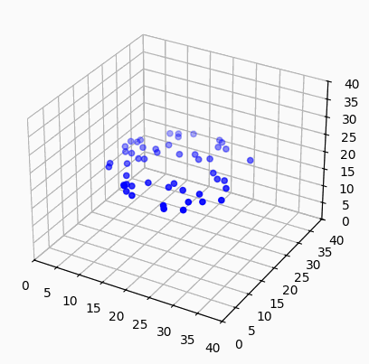

## Collective Behavior Classification (EE475 Final Project)



**Figure:** Torus (milling) behavior.

### Overview
This project focuses on early-stage detection of emergent collective behaviors in an agent-based fish schooling model. The goal is to predict which regime will form (swarm, torus, parallel, or none) using features available early in a run:
- manually engineered features from an early snapshot (positions and directions),
- low-dimensional embeddings via PCA of high-dimensional snapshots, and
- short-trajectory statistics (early-time trends/variability of group directionality P and angular momentum m).

We consider four behavior types:
- **Swarm**
- **Torus** (milling)
- **Parallel** (schooling)
- **No collective behavior**

The simulation engine is provided by `couzinswarm` (by Iain Couzin et al.’s model). The simulation code itself is adapted from `https://github.com/benmaier/couzinswarm` and maintained separately and not included here.

- **Simulation code (external):** `couzinswarm` — install with:
  - `pip install couzinswarm`
  - or see the repository at `https://github.com/gugeyao/couzinswarm`.

### Repository structure
- `simulation_data_collection/`
  - Batch utilities to generate and submit multiple simulation runs.
  - `run_simulation.py`: Runs a single simulation trial with parameters `(speed, turning_rate_degree, repulsion_radius, orientation_width)` and writes outputs per trial:
    - `P_<trial>.txt`, `m_<trial>.txt` (group directionality and angular momentum every 100 steps)
    - `early_snapshot_<trial>.txt` (concatenated positions and directions at an early time)
  - `generate_submission.sh`: Creates an SBATCH script per job that runs `run_simulation.py` many times with randomized parameters.
  - `submit_jobs.sh`: Generates and submits multiple SLURM jobs.

- `Feature_extraction_and_Classification/`
  - `post_process_methods.py`: Utilities to aggregate simulation outputs across parameter sweeps; computes summary features (e.g., late-time means, early-time trends) and writes label/feature files.
  - `ML_methods.py`: Small wrapper providing basic ML pipelines (Logistic Regression, Decision Tree, Random Forest, XGBoost).
  - `ML_methods_comparison_Feature1.py`: Compares ML methods on a hand-selected feature subset.
  - `ML_methods_comparison_Feature2.py`: Compares ML methods on PCA-related feature subset.
  - `ML_methods_comparison_Feature3.py`: Compares ML methods on an alternative feature subset.
  - `Collect_loss_curve.py`: Produces training loss curves for multiple models.

### Important note about paths and portability
All hardcoded cluster-specific absolute paths have been removed from scripts. You can now point scripts to your data using a `--data-dir` flag or the `DATA_DIR` environment variable.

Examples:
```bash
# Set a default data directory for all feature scripts
export DATA_DIR=./data

# Or pass explicitly per script
python3 Feature_extraction_and_Classification/ML_methods_comparison_Feature1.py --data-dir ./data --labels-file labels.txt
python3 Feature_extraction_and_Classification/ML_methods_comparison_Feature2.py --data-dir ./data --labels-file labels_with_PCA.txt
python3 Feature_extraction_and_Classification/Collect_loss_curve.py --data-dir ./data --labels-file labels.txt
```

By default, scripts look for `./data` relative to this repository. Organize your processed outputs (e.g., `labels.txt`, `labels_with_PCA.txt`, and any aggregated high-dimensional snapshots) inside that directory.

### Running simulations
1. Install the simulation engine:
   ```bash
   pip install couzinswarm
   ```
2. From `simulation_data_collection/`, submit jobs:
   ```bash
   bash submit_jobs.sh
   ```
   - Jobs randomly sample parameters and create per-run folders like `speed_<...>_turn_<...>_zor_<...>_zoo_<...>` with outputs.

3. Post-process outputs using `Feature_extraction_and_Classification/post_process_methods.py` to assemble features and labels into files such as `labels.txt` and `labels_with_PCA.txt` in your chosen `--data-dir`.

### Reproducing early-stage feature analysis and classification
Once your `DATA_DIR` contains the aggregated files:
```bash
export DATA_DIR=./data
python3 Feature_extraction_and_Classification/ML_methods_comparison_Feature1.py
python3 Feature_extraction_and_Classification/ML_methods_comparison_Feature2.py
python3 Feature_extraction_and_Classification/ML_methods_comparison_Feature3.py
python3 Feature_extraction_and_Classification/Collect_loss_curve.py
```

Outputs such as `ML_performance.json`, `ML_performance_PCA.json`, `ML_performance_early_trends.json`, and `loss_track.json` will be written back into `DATA_DIR`.

### Notes
- This repository intentionally does not include the `couzinswarm` source. Use the PyPI package or the upstream repository.
- The animated GIF at the top demonstrates the torus (milling) behavior and should play directly on the GitHub page.

### Citation
Please cite the original Couzin model reference when using this project’s simulations or results.

